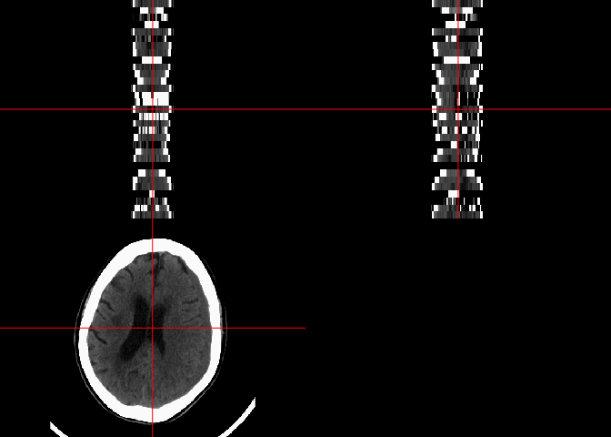

# Description 

This rundown shows how to add the instance number to a DICOM data set, using ImagePositionPatient to have the data to stack correctly.


# Load up Packages


```r
library(dcm2niir)
library(dcmtk)
library(readr)
library(dplyr)
```

```

Attaching package: 'dplyr'
```

```
The following objects are masked from 'package:stats':

    filter, lag
```

```
The following objects are masked from 'package:base':

    intersect, setdiff, setequal, union
```

```r
library(tidyr)
library(neurobase)
```

```
Loading required package: oro.nifti
```

```
oro.nifti 0.10.1
```

```

Attaching package: 'oro.nifti'
```

```
The following object is masked from 'package:dplyr':

    slice
```

```
Registered S3 method overwritten by 'R.oo':
  method        from       
  throw.default R.methodsS3
```

# Data


The data is located at https://johnmuschelli.com/fixing_dicom_files/add_instance_number/data.zip


## Download the data


```r
destfile = "data.zip"
if (!file.exists(destfile)) {
  url = "https://johnmuschelli.com/fixing_dicom_files/add_instance_number/data.zip"
  destfile = tempfile(fileext = ".zip")
  download.file(url, destfile)
}
```

My version of `dcm2niix` is the most up to date GitHub built from source:


```r
dcm2nii_version()
```

```
[1] "Chris Rorden's dcm2niiX version v1.0.20190410  (JP2:OpenJPEG) (JP-LS:CharLS) Clang8.1.0 (64-bit MacOS)"
```

If not, you can run `install_dcm2nii(from_source = TRUE, overwrite = TRUE)`. 

Here we are unzipping the data to a temporary file so we can sandbox our changes to the data:


```r
exdir = tempfile()
dir.create(exdir)
unzip(destfile, exdir = exdir)
paths = list.files(pattern = ".dcm", path = exdir, full.names = TRUE)
```

Here is the header information:


```r
# showing the image position patient
hdr = read_dicom_header(path = exdir, recursive = TRUE)
```

```
/usr/local/bin/dcmdump -q --print-all --load-short --print-filename --recurse --scan-directories '/private/var/folders/1s/wrtqcpxn685_zk570bnx9_rr0000gr/T/RtmpI66EU2/file1689559d57428' --scan-pattern  *.dcm 
```

```r
wide = wide_hdr(hdr)

sort(unique(hdr$name))
```

```
 [1] "BitsAllocated"                  "BitsStored"                    
 [3] "Columns"                        "FileMetaInformationGroupLength"
 [5] "FileMetaInformationVersion"     "HighBit"                       
 [7] "ImageOrientationPatient"        "ImagePositionPatient"          
 [9] "ImplementationClassUID"         "ImplementationVersionName"     
[11] "MediaStorageSOPClassUID"        "MediaStorageSOPInstanceUID"    
[13] "Modality"                       "PatientID"                     
[15] "PhotometricInterpretation"      "PixelData"                     
[17] "PixelRepresentation"            "PixelSpacing"                  
[19] "RescaleIntercept"               "RescaleSlope"                  
[21] "Rows"                           "SamplesPerPixel"               
[23] "SeriesInstanceUID"              "SOPInstanceUID"                
[25] "StudyID"                        "StudyInstanceUID"              
[27] "TransferSyntaxUID"              "WindowCenter"                  
[29] "WindowWidth"                   
```

## Helper Functions

In order to parse some information on the DICOM header, we need some helper functions:


```r
library(readr)
parse_number_no_na = function(x) {
  x[ x %in% c("-", "-", "N/A")] = NA
  na_x = is.na(x)
  x = readr::parse_number(x, na = "")
  bad = is.na(x) & !na_x
  stopifnot(!any(bad))
  x
}

sub_bracket = function(x) {
  x = sub("^\\[", "", x)
  x = sub("\\]$", "", x)
  x = trimws(x)
}
```

## DICOM Headers are missing


```r
# no gantry tilt DICOM header!
any(grepl("ilt", tolower(hdr$name)))
```

```
[1] FALSE
```

```r
any(grepl("instancenum", tolower(hdr$name)))
```

```
[1] FALSE
```

```r
wide = wide %>% 
  mutate(ipp = sub_bracket(gsub("\\\\", ",", ImagePositionPatient))) %>% 
  tidyr::separate(ipp, into = c("x", "y", "z"), remove = FALSE, sep = ",") %>% 
  mutate_at(vars(x, y, z), parse_number_no_na)

# order by z
wide = wide %>% 
  select(file, x, y, z, ipp) %>% 
  arrange(z)
```

Showing the image position patients (ordered for instance number later)


```r
wide %>% 
  mutate(file = basename(file)) %>% 
  select(file, x, y, z) %>% 
  as.data.frame
```

```
               file         x            y         z
1  ID_12a0d6d34.dcm -82.00099 -39.17097000  95.26095
2  ID_12e3b6923.dcm -82.00099 -37.66793000 100.02969
3  ID_6b15a7649.dcm -82.00099 -36.16490000 104.79843
4  ID_7c08b7fb7.dcm -82.00099 -34.66185762 109.56717
5  ID_6cb797177.dcm -82.00099 -33.15882000 114.33591
6  ID_bb2a4a01c.dcm -82.00099 -31.65578000 119.10465
7  ID_6dcedd2e1.dcm -82.00099 -30.15274000 123.87339
8  ID_b494c2115.dcm -82.00099 -28.64971000 128.64213
9  ID_ae7b11865.dcm -82.00099 -27.14667000 133.41087
10 ID_21053fe7e.dcm -82.00099 -25.64363056 138.17961
11 ID_f4891876d.dcm -82.00099 -24.14059000 142.94835
12 ID_18aac96c0.dcm -82.00099 -22.63755000 147.71709
13 ID_8a35660d5.dcm -82.00099 -21.13452000 152.48583
14 ID_d4ea87a35.dcm -82.00099 -19.63148000 157.25457
15 ID_0b0e59911.dcm -82.00099 -18.12844000 162.02331
16 ID_97e5a203e.dcm -82.00099 -16.62540350 166.79205
17 ID_ac39010dc.dcm -82.00099 -15.12237000 171.56079
18 ID_4f0317d23.dcm -82.00099 -13.61933000 176.32953
19 ID_362423b57.dcm -82.00099 -12.11629000 181.09826
20 ID_dd3b5bf4e.dcm -82.00099 -10.61325000 185.86700
21 ID_8f5d4b696.dcm -82.00099  -9.11021400 190.63574
22 ID_66accd2e4.dcm -82.00099  -7.60717600 195.40448
23 ID_17103c79e.dcm -82.00099  -6.10413900 200.17322
24 ID_9a3bba619.dcm -82.00099  -4.60110100 204.94196
25 ID_8d0ca7742.dcm -82.00099  -3.09806300 209.71070
26 ID_c4575f13b.dcm -82.00099  -1.59502500 214.47944
27 ID_3cb1b59bc.dcm -82.00099  -0.09198722 219.24818
28 ID_c35d5c858.dcm -82.00099   1.41105063 224.01692
29 ID_317330708.dcm -82.00099   2.91408847 228.78566
30 ID_8144c7120.dcm -82.00099   4.41712631 233.55440
31 ID_d7777de78.dcm -82.00099   5.92016416 238.32314
```

Here is the output of `dcm2niix` on the original data


```r
d_res = dcm2nii(
  basedir = exdir,
  opts = " -v y ")
```

```
#Copying Files
```

```
# Converting to nii 
```

```
'/Library/Frameworks/R.framework/Versions/3.6/Resources/library/dcm2niir/dcm2niix'  -v y  '/var/folders/1s/wrtqcpxn685_zk570bnx9_rr0000gr/T/RtmpI66EU2/file1689520485036'
```

```
Warning in dcm2nii(basedir = exdir, opts = " -v y "): Result indicated an
error! Please check results.
```

```r
d_res
```

```
$result
[1] 1

$nii_before
character(0)

$nii_after
[1] "/var/folders/1s/wrtqcpxn685_zk570bnx9_rr0000gr/T/RtmpI66EU2/file1689520485036/_0_3760890702.nii.gz"

$json_after
[1] "/var/folders/1s/wrtqcpxn685_zk570bnx9_rr0000gr/T/RtmpI66EU2/file1689520485036/_0_3760890702.json"

$json_before
character(0)

$cmd
[1] "'/Library/Frameworks/R.framework/Versions/3.6/Resources/library/dcm2niir/dcm2niix'  -v y  '/var/folders/1s/wrtqcpxn685_zk570bnx9_rr0000gr/T/RtmpI66EU2/file1689520485036'"
```

```r
img = readnii(d_res$nii_after)
dim(img)
```

```
[1] 404 430  31
```

```r
ortho2(window_img(img))
```

<!-- -->


Let's look at the last slice:


```r
ortho2(window_img(img), xyz = c(202, 215, 1))
```

<!-- -->

# Fixing the Instance Number

## Copy the data

Here we are copying the data to a different folder to make instance number


```r
tmpdir = tempfile()
dir.create(tmpdir)
file.copy(paths, tmpdir)
```

```
 [1] TRUE TRUE TRUE TRUE TRUE TRUE TRUE TRUE TRUE TRUE TRUE TRUE TRUE TRUE
[15] TRUE TRUE TRUE TRUE TRUE TRUE TRUE TRUE TRUE TRUE TRUE TRUE TRUE TRUE
[29] TRUE TRUE TRUE
```

## Modifying the Instance Number

Here we are making the instance number spatial on z, modifying the instance number using the tag `(0020,0013)`: 


```r
tmp_paths = file.path(tmpdir, basename(wide$file))
ind = seq_along(tmp_paths)
add_instance = function(file, index) {
  dcmtk::dcmodify(
    file = file,
    frontopts = paste0('-i "(0020,0013)=', index, '"')
  )
  hdr = read_dicom_header(file)
  new_inst = as.numeric(sub_bracket(hdr$value[hdr$name == "InstanceNumber"]))
  stopifnot(new_inst == index)
  print(new_inst)
  bakfile = paste0(file, ".bak")
  if (file.exists(bakfile)) {
    file.remove(bakfile)
  }
}
res = mapply(add_instance, tmp_paths, ind)
```

```
/usr/local/bin/dcmodify -i "(0020,0013)=1"  /var/folders/1s/wrtqcpxn685_zk570bnx9_rr0000gr/T//RtmpI66EU2/file16895222ed4e9/ID_12a0d6d34.dcm 
```

```
/usr/local/bin/dcmdump -q --print-all --load-short --print-filename  /var/folders/1s/wrtqcpxn685_zk570bnx9_rr0000gr/T//RtmpI66EU2/file16895222ed4e9/ID_12a0d6d34.dcm 
```

```
[1] 1
```

```
/usr/local/bin/dcmodify -i "(0020,0013)=2"  /var/folders/1s/wrtqcpxn685_zk570bnx9_rr0000gr/T//RtmpI66EU2/file16895222ed4e9/ID_12e3b6923.dcm 
```

```
/usr/local/bin/dcmdump -q --print-all --load-short --print-filename  /var/folders/1s/wrtqcpxn685_zk570bnx9_rr0000gr/T//RtmpI66EU2/file16895222ed4e9/ID_12e3b6923.dcm 
```

```
[1] 2
```

```
/usr/local/bin/dcmodify -i "(0020,0013)=3"  /var/folders/1s/wrtqcpxn685_zk570bnx9_rr0000gr/T//RtmpI66EU2/file16895222ed4e9/ID_6b15a7649.dcm 
```

```
/usr/local/bin/dcmdump -q --print-all --load-short --print-filename  /var/folders/1s/wrtqcpxn685_zk570bnx9_rr0000gr/T//RtmpI66EU2/file16895222ed4e9/ID_6b15a7649.dcm 
```

```
[1] 3
```

```
/usr/local/bin/dcmodify -i "(0020,0013)=4"  /var/folders/1s/wrtqcpxn685_zk570bnx9_rr0000gr/T//RtmpI66EU2/file16895222ed4e9/ID_7c08b7fb7.dcm 
```

```
/usr/local/bin/dcmdump -q --print-all --load-short --print-filename  /var/folders/1s/wrtqcpxn685_zk570bnx9_rr0000gr/T//RtmpI66EU2/file16895222ed4e9/ID_7c08b7fb7.dcm 
```

```
[1] 4
```

```
/usr/local/bin/dcmodify -i "(0020,0013)=5"  /var/folders/1s/wrtqcpxn685_zk570bnx9_rr0000gr/T//RtmpI66EU2/file16895222ed4e9/ID_6cb797177.dcm 
```

```
/usr/local/bin/dcmdump -q --print-all --load-short --print-filename  /var/folders/1s/wrtqcpxn685_zk570bnx9_rr0000gr/T//RtmpI66EU2/file16895222ed4e9/ID_6cb797177.dcm 
```

```
[1] 5
```

```
/usr/local/bin/dcmodify -i "(0020,0013)=6"  /var/folders/1s/wrtqcpxn685_zk570bnx9_rr0000gr/T//RtmpI66EU2/file16895222ed4e9/ID_bb2a4a01c.dcm 
```

```
/usr/local/bin/dcmdump -q --print-all --load-short --print-filename  /var/folders/1s/wrtqcpxn685_zk570bnx9_rr0000gr/T//RtmpI66EU2/file16895222ed4e9/ID_bb2a4a01c.dcm 
```

```
[1] 6
```

```
/usr/local/bin/dcmodify -i "(0020,0013)=7"  /var/folders/1s/wrtqcpxn685_zk570bnx9_rr0000gr/T//RtmpI66EU2/file16895222ed4e9/ID_6dcedd2e1.dcm 
```

```
/usr/local/bin/dcmdump -q --print-all --load-short --print-filename  /var/folders/1s/wrtqcpxn685_zk570bnx9_rr0000gr/T//RtmpI66EU2/file16895222ed4e9/ID_6dcedd2e1.dcm 
```

```
[1] 7
```

```
/usr/local/bin/dcmodify -i "(0020,0013)=8"  /var/folders/1s/wrtqcpxn685_zk570bnx9_rr0000gr/T//RtmpI66EU2/file16895222ed4e9/ID_b494c2115.dcm 
```

```
/usr/local/bin/dcmdump -q --print-all --load-short --print-filename  /var/folders/1s/wrtqcpxn685_zk570bnx9_rr0000gr/T//RtmpI66EU2/file16895222ed4e9/ID_b494c2115.dcm 
```

```
[1] 8
```

```
/usr/local/bin/dcmodify -i "(0020,0013)=9"  /var/folders/1s/wrtqcpxn685_zk570bnx9_rr0000gr/T//RtmpI66EU2/file16895222ed4e9/ID_ae7b11865.dcm 
```

```
/usr/local/bin/dcmdump -q --print-all --load-short --print-filename  /var/folders/1s/wrtqcpxn685_zk570bnx9_rr0000gr/T//RtmpI66EU2/file16895222ed4e9/ID_ae7b11865.dcm 
```

```
[1] 9
```

```
/usr/local/bin/dcmodify -i "(0020,0013)=10"  /var/folders/1s/wrtqcpxn685_zk570bnx9_rr0000gr/T//RtmpI66EU2/file16895222ed4e9/ID_21053fe7e.dcm 
```

```
/usr/local/bin/dcmdump -q --print-all --load-short --print-filename  /var/folders/1s/wrtqcpxn685_zk570bnx9_rr0000gr/T//RtmpI66EU2/file16895222ed4e9/ID_21053fe7e.dcm 
```

```
[1] 10
```

```
/usr/local/bin/dcmodify -i "(0020,0013)=11"  /var/folders/1s/wrtqcpxn685_zk570bnx9_rr0000gr/T//RtmpI66EU2/file16895222ed4e9/ID_f4891876d.dcm 
```

```
/usr/local/bin/dcmdump -q --print-all --load-short --print-filename  /var/folders/1s/wrtqcpxn685_zk570bnx9_rr0000gr/T//RtmpI66EU2/file16895222ed4e9/ID_f4891876d.dcm 
```

```
[1] 11
```

```
/usr/local/bin/dcmodify -i "(0020,0013)=12"  /var/folders/1s/wrtqcpxn685_zk570bnx9_rr0000gr/T//RtmpI66EU2/file16895222ed4e9/ID_18aac96c0.dcm 
```

```
/usr/local/bin/dcmdump -q --print-all --load-short --print-filename  /var/folders/1s/wrtqcpxn685_zk570bnx9_rr0000gr/T//RtmpI66EU2/file16895222ed4e9/ID_18aac96c0.dcm 
```

```
[1] 12
```

```
/usr/local/bin/dcmodify -i "(0020,0013)=13"  /var/folders/1s/wrtqcpxn685_zk570bnx9_rr0000gr/T//RtmpI66EU2/file16895222ed4e9/ID_8a35660d5.dcm 
```

```
/usr/local/bin/dcmdump -q --print-all --load-short --print-filename  /var/folders/1s/wrtqcpxn685_zk570bnx9_rr0000gr/T//RtmpI66EU2/file16895222ed4e9/ID_8a35660d5.dcm 
```

```
[1] 13
```

```
/usr/local/bin/dcmodify -i "(0020,0013)=14"  /var/folders/1s/wrtqcpxn685_zk570bnx9_rr0000gr/T//RtmpI66EU2/file16895222ed4e9/ID_d4ea87a35.dcm 
```

```
/usr/local/bin/dcmdump -q --print-all --load-short --print-filename  /var/folders/1s/wrtqcpxn685_zk570bnx9_rr0000gr/T//RtmpI66EU2/file16895222ed4e9/ID_d4ea87a35.dcm 
```

```
[1] 14
```

```
/usr/local/bin/dcmodify -i "(0020,0013)=15"  /var/folders/1s/wrtqcpxn685_zk570bnx9_rr0000gr/T//RtmpI66EU2/file16895222ed4e9/ID_0b0e59911.dcm 
```

```
/usr/local/bin/dcmdump -q --print-all --load-short --print-filename  /var/folders/1s/wrtqcpxn685_zk570bnx9_rr0000gr/T//RtmpI66EU2/file16895222ed4e9/ID_0b0e59911.dcm 
```

```
[1] 15
```

```
/usr/local/bin/dcmodify -i "(0020,0013)=16"  /var/folders/1s/wrtqcpxn685_zk570bnx9_rr0000gr/T//RtmpI66EU2/file16895222ed4e9/ID_97e5a203e.dcm 
```

```
/usr/local/bin/dcmdump -q --print-all --load-short --print-filename  /var/folders/1s/wrtqcpxn685_zk570bnx9_rr0000gr/T//RtmpI66EU2/file16895222ed4e9/ID_97e5a203e.dcm 
```

```
[1] 16
```

```
/usr/local/bin/dcmodify -i "(0020,0013)=17"  /var/folders/1s/wrtqcpxn685_zk570bnx9_rr0000gr/T//RtmpI66EU2/file16895222ed4e9/ID_ac39010dc.dcm 
```

```
/usr/local/bin/dcmdump -q --print-all --load-short --print-filename  /var/folders/1s/wrtqcpxn685_zk570bnx9_rr0000gr/T//RtmpI66EU2/file16895222ed4e9/ID_ac39010dc.dcm 
```

```
[1] 17
```

```
/usr/local/bin/dcmodify -i "(0020,0013)=18"  /var/folders/1s/wrtqcpxn685_zk570bnx9_rr0000gr/T//RtmpI66EU2/file16895222ed4e9/ID_4f0317d23.dcm 
```

```
/usr/local/bin/dcmdump -q --print-all --load-short --print-filename  /var/folders/1s/wrtqcpxn685_zk570bnx9_rr0000gr/T//RtmpI66EU2/file16895222ed4e9/ID_4f0317d23.dcm 
```

```
[1] 18
```

```
/usr/local/bin/dcmodify -i "(0020,0013)=19"  /var/folders/1s/wrtqcpxn685_zk570bnx9_rr0000gr/T//RtmpI66EU2/file16895222ed4e9/ID_362423b57.dcm 
```

```
/usr/local/bin/dcmdump -q --print-all --load-short --print-filename  /var/folders/1s/wrtqcpxn685_zk570bnx9_rr0000gr/T//RtmpI66EU2/file16895222ed4e9/ID_362423b57.dcm 
```

```
[1] 19
```

```
/usr/local/bin/dcmodify -i "(0020,0013)=20"  /var/folders/1s/wrtqcpxn685_zk570bnx9_rr0000gr/T//RtmpI66EU2/file16895222ed4e9/ID_dd3b5bf4e.dcm 
```

```
/usr/local/bin/dcmdump -q --print-all --load-short --print-filename  /var/folders/1s/wrtqcpxn685_zk570bnx9_rr0000gr/T//RtmpI66EU2/file16895222ed4e9/ID_dd3b5bf4e.dcm 
```

```
[1] 20
```

```
/usr/local/bin/dcmodify -i "(0020,0013)=21"  /var/folders/1s/wrtqcpxn685_zk570bnx9_rr0000gr/T//RtmpI66EU2/file16895222ed4e9/ID_8f5d4b696.dcm 
```

```
/usr/local/bin/dcmdump -q --print-all --load-short --print-filename  /var/folders/1s/wrtqcpxn685_zk570bnx9_rr0000gr/T//RtmpI66EU2/file16895222ed4e9/ID_8f5d4b696.dcm 
```

```
[1] 21
```

```
/usr/local/bin/dcmodify -i "(0020,0013)=22"  /var/folders/1s/wrtqcpxn685_zk570bnx9_rr0000gr/T//RtmpI66EU2/file16895222ed4e9/ID_66accd2e4.dcm 
```

```
/usr/local/bin/dcmdump -q --print-all --load-short --print-filename  /var/folders/1s/wrtqcpxn685_zk570bnx9_rr0000gr/T//RtmpI66EU2/file16895222ed4e9/ID_66accd2e4.dcm 
```

```
[1] 22
```

```
/usr/local/bin/dcmodify -i "(0020,0013)=23"  /var/folders/1s/wrtqcpxn685_zk570bnx9_rr0000gr/T//RtmpI66EU2/file16895222ed4e9/ID_17103c79e.dcm 
```

```
/usr/local/bin/dcmdump -q --print-all --load-short --print-filename  /var/folders/1s/wrtqcpxn685_zk570bnx9_rr0000gr/T//RtmpI66EU2/file16895222ed4e9/ID_17103c79e.dcm 
```

```
[1] 23
```

```
/usr/local/bin/dcmodify -i "(0020,0013)=24"  /var/folders/1s/wrtqcpxn685_zk570bnx9_rr0000gr/T//RtmpI66EU2/file16895222ed4e9/ID_9a3bba619.dcm 
```

```
/usr/local/bin/dcmdump -q --print-all --load-short --print-filename  /var/folders/1s/wrtqcpxn685_zk570bnx9_rr0000gr/T//RtmpI66EU2/file16895222ed4e9/ID_9a3bba619.dcm 
```

```
[1] 24
```

```
/usr/local/bin/dcmodify -i "(0020,0013)=25"  /var/folders/1s/wrtqcpxn685_zk570bnx9_rr0000gr/T//RtmpI66EU2/file16895222ed4e9/ID_8d0ca7742.dcm 
```

```
/usr/local/bin/dcmdump -q --print-all --load-short --print-filename  /var/folders/1s/wrtqcpxn685_zk570bnx9_rr0000gr/T//RtmpI66EU2/file16895222ed4e9/ID_8d0ca7742.dcm 
```

```
[1] 25
```

```
/usr/local/bin/dcmodify -i "(0020,0013)=26"  /var/folders/1s/wrtqcpxn685_zk570bnx9_rr0000gr/T//RtmpI66EU2/file16895222ed4e9/ID_c4575f13b.dcm 
```

```
/usr/local/bin/dcmdump -q --print-all --load-short --print-filename  /var/folders/1s/wrtqcpxn685_zk570bnx9_rr0000gr/T//RtmpI66EU2/file16895222ed4e9/ID_c4575f13b.dcm 
```

```
[1] 26
```

```
/usr/local/bin/dcmodify -i "(0020,0013)=27"  /var/folders/1s/wrtqcpxn685_zk570bnx9_rr0000gr/T//RtmpI66EU2/file16895222ed4e9/ID_3cb1b59bc.dcm 
```

```
/usr/local/bin/dcmdump -q --print-all --load-short --print-filename  /var/folders/1s/wrtqcpxn685_zk570bnx9_rr0000gr/T//RtmpI66EU2/file16895222ed4e9/ID_3cb1b59bc.dcm 
```

```
[1] 27
```

```
/usr/local/bin/dcmodify -i "(0020,0013)=28"  /var/folders/1s/wrtqcpxn685_zk570bnx9_rr0000gr/T//RtmpI66EU2/file16895222ed4e9/ID_c35d5c858.dcm 
```

```
/usr/local/bin/dcmdump -q --print-all --load-short --print-filename  /var/folders/1s/wrtqcpxn685_zk570bnx9_rr0000gr/T//RtmpI66EU2/file16895222ed4e9/ID_c35d5c858.dcm 
```

```
[1] 28
```

```
/usr/local/bin/dcmodify -i "(0020,0013)=29"  /var/folders/1s/wrtqcpxn685_zk570bnx9_rr0000gr/T//RtmpI66EU2/file16895222ed4e9/ID_317330708.dcm 
```

```
/usr/local/bin/dcmdump -q --print-all --load-short --print-filename  /var/folders/1s/wrtqcpxn685_zk570bnx9_rr0000gr/T//RtmpI66EU2/file16895222ed4e9/ID_317330708.dcm 
```

```
[1] 29
```

```
/usr/local/bin/dcmodify -i "(0020,0013)=30"  /var/folders/1s/wrtqcpxn685_zk570bnx9_rr0000gr/T//RtmpI66EU2/file16895222ed4e9/ID_8144c7120.dcm 
```

```
/usr/local/bin/dcmdump -q --print-all --load-short --print-filename  /var/folders/1s/wrtqcpxn685_zk570bnx9_rr0000gr/T//RtmpI66EU2/file16895222ed4e9/ID_8144c7120.dcm 
```

```
[1] 30
```

```
/usr/local/bin/dcmodify -i "(0020,0013)=31"  /var/folders/1s/wrtqcpxn685_zk570bnx9_rr0000gr/T//RtmpI66EU2/file16895222ed4e9/ID_d7777de78.dcm 
```

```
/usr/local/bin/dcmdump -q --print-all --load-short --print-filename  /var/folders/1s/wrtqcpxn685_zk570bnx9_rr0000gr/T//RtmpI66EU2/file16895222ed4e9/ID_d7777de78.dcm 
```

```
[1] 31
```

Checking the instance number is correct:


```r
tmp_hdr = lapply(tmp_paths, read_dicom_header)
```

```
/usr/local/bin/dcmdump -q --print-all --load-short --print-filename  /var/folders/1s/wrtqcpxn685_zk570bnx9_rr0000gr/T//RtmpI66EU2/file16895222ed4e9/ID_12a0d6d34.dcm 
```

```
/usr/local/bin/dcmdump -q --print-all --load-short --print-filename  /var/folders/1s/wrtqcpxn685_zk570bnx9_rr0000gr/T//RtmpI66EU2/file16895222ed4e9/ID_12e3b6923.dcm 
```

```
/usr/local/bin/dcmdump -q --print-all --load-short --print-filename  /var/folders/1s/wrtqcpxn685_zk570bnx9_rr0000gr/T//RtmpI66EU2/file16895222ed4e9/ID_6b15a7649.dcm 
```

```
/usr/local/bin/dcmdump -q --print-all --load-short --print-filename  /var/folders/1s/wrtqcpxn685_zk570bnx9_rr0000gr/T//RtmpI66EU2/file16895222ed4e9/ID_7c08b7fb7.dcm 
```

```
/usr/local/bin/dcmdump -q --print-all --load-short --print-filename  /var/folders/1s/wrtqcpxn685_zk570bnx9_rr0000gr/T//RtmpI66EU2/file16895222ed4e9/ID_6cb797177.dcm 
```

```
/usr/local/bin/dcmdump -q --print-all --load-short --print-filename  /var/folders/1s/wrtqcpxn685_zk570bnx9_rr0000gr/T//RtmpI66EU2/file16895222ed4e9/ID_bb2a4a01c.dcm 
```

```
/usr/local/bin/dcmdump -q --print-all --load-short --print-filename  /var/folders/1s/wrtqcpxn685_zk570bnx9_rr0000gr/T//RtmpI66EU2/file16895222ed4e9/ID_6dcedd2e1.dcm 
```

```
/usr/local/bin/dcmdump -q --print-all --load-short --print-filename  /var/folders/1s/wrtqcpxn685_zk570bnx9_rr0000gr/T//RtmpI66EU2/file16895222ed4e9/ID_b494c2115.dcm 
```

```
/usr/local/bin/dcmdump -q --print-all --load-short --print-filename  /var/folders/1s/wrtqcpxn685_zk570bnx9_rr0000gr/T//RtmpI66EU2/file16895222ed4e9/ID_ae7b11865.dcm 
```

```
/usr/local/bin/dcmdump -q --print-all --load-short --print-filename  /var/folders/1s/wrtqcpxn685_zk570bnx9_rr0000gr/T//RtmpI66EU2/file16895222ed4e9/ID_21053fe7e.dcm 
```

```
/usr/local/bin/dcmdump -q --print-all --load-short --print-filename  /var/folders/1s/wrtqcpxn685_zk570bnx9_rr0000gr/T//RtmpI66EU2/file16895222ed4e9/ID_f4891876d.dcm 
```

```
/usr/local/bin/dcmdump -q --print-all --load-short --print-filename  /var/folders/1s/wrtqcpxn685_zk570bnx9_rr0000gr/T//RtmpI66EU2/file16895222ed4e9/ID_18aac96c0.dcm 
```

```
/usr/local/bin/dcmdump -q --print-all --load-short --print-filename  /var/folders/1s/wrtqcpxn685_zk570bnx9_rr0000gr/T//RtmpI66EU2/file16895222ed4e9/ID_8a35660d5.dcm 
```

```
/usr/local/bin/dcmdump -q --print-all --load-short --print-filename  /var/folders/1s/wrtqcpxn685_zk570bnx9_rr0000gr/T//RtmpI66EU2/file16895222ed4e9/ID_d4ea87a35.dcm 
```

```
/usr/local/bin/dcmdump -q --print-all --load-short --print-filename  /var/folders/1s/wrtqcpxn685_zk570bnx9_rr0000gr/T//RtmpI66EU2/file16895222ed4e9/ID_0b0e59911.dcm 
```

```
/usr/local/bin/dcmdump -q --print-all --load-short --print-filename  /var/folders/1s/wrtqcpxn685_zk570bnx9_rr0000gr/T//RtmpI66EU2/file16895222ed4e9/ID_97e5a203e.dcm 
```

```
/usr/local/bin/dcmdump -q --print-all --load-short --print-filename  /var/folders/1s/wrtqcpxn685_zk570bnx9_rr0000gr/T//RtmpI66EU2/file16895222ed4e9/ID_ac39010dc.dcm 
```

```
/usr/local/bin/dcmdump -q --print-all --load-short --print-filename  /var/folders/1s/wrtqcpxn685_zk570bnx9_rr0000gr/T//RtmpI66EU2/file16895222ed4e9/ID_4f0317d23.dcm 
```

```
/usr/local/bin/dcmdump -q --print-all --load-short --print-filename  /var/folders/1s/wrtqcpxn685_zk570bnx9_rr0000gr/T//RtmpI66EU2/file16895222ed4e9/ID_362423b57.dcm 
```

```
/usr/local/bin/dcmdump -q --print-all --load-short --print-filename  /var/folders/1s/wrtqcpxn685_zk570bnx9_rr0000gr/T//RtmpI66EU2/file16895222ed4e9/ID_dd3b5bf4e.dcm 
```

```
/usr/local/bin/dcmdump -q --print-all --load-short --print-filename  /var/folders/1s/wrtqcpxn685_zk570bnx9_rr0000gr/T//RtmpI66EU2/file16895222ed4e9/ID_8f5d4b696.dcm 
```

```
/usr/local/bin/dcmdump -q --print-all --load-short --print-filename  /var/folders/1s/wrtqcpxn685_zk570bnx9_rr0000gr/T//RtmpI66EU2/file16895222ed4e9/ID_66accd2e4.dcm 
```

```
/usr/local/bin/dcmdump -q --print-all --load-short --print-filename  /var/folders/1s/wrtqcpxn685_zk570bnx9_rr0000gr/T//RtmpI66EU2/file16895222ed4e9/ID_17103c79e.dcm 
```

```
/usr/local/bin/dcmdump -q --print-all --load-short --print-filename  /var/folders/1s/wrtqcpxn685_zk570bnx9_rr0000gr/T//RtmpI66EU2/file16895222ed4e9/ID_9a3bba619.dcm 
```

```
/usr/local/bin/dcmdump -q --print-all --load-short --print-filename  /var/folders/1s/wrtqcpxn685_zk570bnx9_rr0000gr/T//RtmpI66EU2/file16895222ed4e9/ID_8d0ca7742.dcm 
```

```
/usr/local/bin/dcmdump -q --print-all --load-short --print-filename  /var/folders/1s/wrtqcpxn685_zk570bnx9_rr0000gr/T//RtmpI66EU2/file16895222ed4e9/ID_c4575f13b.dcm 
```

```
/usr/local/bin/dcmdump -q --print-all --load-short --print-filename  /var/folders/1s/wrtqcpxn685_zk570bnx9_rr0000gr/T//RtmpI66EU2/file16895222ed4e9/ID_3cb1b59bc.dcm 
```

```
/usr/local/bin/dcmdump -q --print-all --load-short --print-filename  /var/folders/1s/wrtqcpxn685_zk570bnx9_rr0000gr/T//RtmpI66EU2/file16895222ed4e9/ID_c35d5c858.dcm 
```

```
/usr/local/bin/dcmdump -q --print-all --load-short --print-filename  /var/folders/1s/wrtqcpxn685_zk570bnx9_rr0000gr/T//RtmpI66EU2/file16895222ed4e9/ID_317330708.dcm 
```

```
/usr/local/bin/dcmdump -q --print-all --load-short --print-filename  /var/folders/1s/wrtqcpxn685_zk570bnx9_rr0000gr/T//RtmpI66EU2/file16895222ed4e9/ID_8144c7120.dcm 
```

```
/usr/local/bin/dcmdump -q --print-all --load-short --print-filename  /var/folders/1s/wrtqcpxn685_zk570bnx9_rr0000gr/T//RtmpI66EU2/file16895222ed4e9/ID_d7777de78.dcm 
```

```r
tmp_hdr = bind_rows(tmp_hdr)
# arranging because reshaping can cause reordering of files
tmp_hdr = tmp_hdr %>% 
  mutate(file = factor(tmp_hdr$file, levels = tmp_paths)) %>% 
  arrange(file)
tmp_wide = wide_hdr(tmp_hdr)
tmp_wide$InstanceNumber
```

```
 [1] "[1]"  "[2]"  "[3]"  "[4]"  "[5]"  "[6]"  "[7]"  "[8]"  "[9]"  "[10]"
[11] "[11]" "[12]" "[13]" "[14]" "[15]" "[16]" "[17]" "[18]" "[19]" "[20]"
[21] "[21]" "[22]" "[23]" "[24]" "[25]" "[26]" "[27]" "[28]" "[29]" "[30]"
[31] "[31]"
```

Checking the output with filled in instance number


```r
inst_res = dcm2nii(
  basedir = tmpdir,
  # files = tmp_paths,
  opts = " -v y ")
```

```
#Copying Files
```

```
# Converting to nii 
```

```
'/Library/Frameworks/R.framework/Versions/3.6/Resources/library/dcm2niir/dcm2niix'  -v y  '/var/folders/1s/wrtqcpxn685_zk570bnx9_rr0000gr/T/RtmpI66EU2/file1689530146c2c'
```

```r
inst_res
```

```
$result
[1] 0

$nii_before
character(0)

$nii_after
[1] "/var/folders/1s/wrtqcpxn685_zk570bnx9_rr0000gr/T/RtmpI66EU2/file1689530146c2c/_0_3760890702.nii.gz"

$json_after
[1] "/var/folders/1s/wrtqcpxn685_zk570bnx9_rr0000gr/T/RtmpI66EU2/file1689530146c2c/_0_3760890702.json"

$json_before
character(0)

$cmd
[1] "'/Library/Frameworks/R.framework/Versions/3.6/Resources/library/dcm2niir/dcm2niix'  -v y  '/var/folders/1s/wrtqcpxn685_zk570bnx9_rr0000gr/T/RtmpI66EU2/file1689530146c2c'"
```

```r
inst_img = readnii(inst_res$nii_after)
dim(inst_img)
```

```
[1] 404 430  31
```

## Correct Output 

Note the last slice:


```r
ortho2(window_img(inst_img))
```

<!-- -->


Let's look at the last slice:


```r
ortho2(window_img(inst_img), xyz = c(202, 215, 1))
```

<!-- -->


<details>

<summary>Session info</summary>

Here is my session information to ensure reproducibility for packages:


```r
devtools::session_info()
```

```
─ Session info ──────────────────────────────────────────────────────────
 setting  value                       
 version  R version 3.6.0 (2019-04-26)
 os       macOS Mojave 10.14.6        
 system   x86_64, darwin15.6.0        
 ui       X11                         
 language (EN)                        
 collate  en_US.UTF-8                 
 ctype    en_US.UTF-8                 
 tz       America/New_York            
 date     2019-11-13                  

─ Packages ──────────────────────────────────────────────────────────────
 package     * version     date       lib
 abind         1.4-5       2016-07-21 [1]
 assertthat    0.2.1       2019-03-21 [1]
 backports     1.1.4       2019-04-10 [1]
 bitops        1.0-6       2013-08-17 [1]
 callr         3.3.2       2019-09-22 [1]
 cli           1.1.0       2019-03-19 [1]
 colorout    * 1.2-1       2019-06-19 [1]
 crayon        1.3.4       2017-09-16 [1]
 dcm2niir    * 0.6.9       2019-10-22 [1]
 dcmtk       * 0.6.8.1     2019-09-27 [1]
 desc          1.2.0       2019-07-10 [1]
 devtools      2.2.0.9000  2019-09-10 [1]
 digest        0.6.22      2019-10-21 [1]
 dplyr       * 0.8.3       2019-07-04 [1]
 DT            0.8         2019-08-07 [1]
 ellipsis      0.3.0       2019-09-20 [1]
 evaluate      0.14        2019-05-28 [1]
 fs            1.3.1       2019-05-06 [1]
 git2r         0.26.1      2019-06-29 [1]
 glue          1.3.1       2019-03-12 [1]
 hms           0.5.1       2019-08-23 [1]
 htmltools     0.4.0       2019-10-04 [1]
 htmlwidgets   1.3         2018-09-30 [1]
 httr          1.4.1       2019-08-05 [1]
 knitr         1.24.3      2019-08-28 [1]
 lifecycle     0.1.0       2019-08-01 [1]
 lubridate     1.7.4       2018-04-11 [1]
 magrittr      1.5         2014-11-22 [1]
 matrixStats   0.55.0      2019-09-07 [1]
 memoise       1.1.0       2017-04-21 [1]
 neurobase   * 1.28.0      2019-10-14 [1]
 oro.nifti   * 0.10.1      2019-08-12 [1]
 pillar        1.4.2       2019-06-29 [1]
 pkgbuild      1.0.5       2019-08-26 [1]
 pkgconfig     2.0.3       2019-09-22 [1]
 pkgload       1.0.2       2018-10-29 [1]
 prettyunits   1.0.2       2015-07-13 [1]
 processx      3.4.1       2019-07-18 [1]
 ps            1.3.0       2018-12-21 [1]
 purrr         0.3.2       2019-03-15 [1]
 R.methodsS3   1.7.1       2016-02-16 [1]
 R.oo          1.22.0      2018-04-22 [1]
 R.utils       2.9.0       2019-06-13 [1]
 R6            2.4.0       2019-02-14 [1]
 Rcpp          1.0.2       2019-07-25 [1]
 readr       * 1.3.1       2018-12-21 [1]
 remotes       2.1.0       2019-06-24 [1]
 rlang         0.4.1       2019-10-24 [1]
 rmarkdown     1.16        2019-10-01 [1]
 RNifti        0.11.1      2019-09-26 [1]
 rprojroot     1.3-2       2018-01-03 [1]
 rstudioapi    0.10.0-9001 2019-09-10 [1]
 sessioninfo   1.1.1       2018-11-05 [1]
 stringi       1.4.3       2019-03-12 [1]
 stringr       1.4.0       2019-02-10 [1]
 testthat      2.2.1       2019-07-25 [1]
 tibble        2.1.3       2019-06-06 [1]
 tidyr       * 1.0.0       2019-09-11 [1]
 tidyselect    0.2.5       2018-10-11 [1]
 usethis       1.5.1.9000  2019-08-15 [1]
 vctrs         0.2.0       2019-07-05 [1]
 withr         2.1.2       2018-03-15 [1]
 xfun          0.10        2019-10-01 [1]
 yaml          2.2.0       2018-07-25 [1]
 zeallot       0.1.0       2018-01-28 [1]
 source                             
 CRAN (R 3.6.0)                     
 CRAN (R 3.6.0)                     
 CRAN (R 3.6.0)                     
 CRAN (R 3.6.0)                     
 CRAN (R 3.6.0)                     
 CRAN (R 3.6.0)                     
 Github (jalvesaq/colorout@7ea9440) 
 CRAN (R 3.6.0)                     
 local                              
 local                              
 Github (muschellij2/desc@b0c374f)  
 Github (r-lib/devtools@d7f0915)    
 CRAN (R 3.6.0)                     
 CRAN (R 3.6.0)                     
 CRAN (R 3.6.0)                     
 CRAN (R 3.6.0)                     
 CRAN (R 3.6.0)                     
 CRAN (R 3.6.0)                     
 CRAN (R 3.6.0)                     
 CRAN (R 3.6.0)                     
 CRAN (R 3.6.0)                     
 CRAN (R 3.6.0)                     
 CRAN (R 3.6.0)                     
 CRAN (R 3.6.0)                     
 Github (muschellij2/knitr@abcea3d) 
 CRAN (R 3.6.0)                     
 CRAN (R 3.6.0)                     
 CRAN (R 3.6.0)                     
 CRAN (R 3.6.0)                     
 CRAN (R 3.6.0)                     
 local                              
 local                              
 CRAN (R 3.6.0)                     
 CRAN (R 3.6.0)                     
 CRAN (R 3.6.0)                     
 CRAN (R 3.6.0)                     
 CRAN (R 3.6.0)                     
 CRAN (R 3.6.0)                     
 CRAN (R 3.6.0)                     
 CRAN (R 3.6.0)                     
 CRAN (R 3.6.0)                     
 CRAN (R 3.6.0)                     
 CRAN (R 3.6.0)                     
 CRAN (R 3.6.0)                     
 CRAN (R 3.6.0)                     
 CRAN (R 3.6.0)                     
 CRAN (R 3.6.0)                     
 CRAN (R 3.6.0)                     
 CRAN (R 3.6.0)                     
 local                              
 CRAN (R 3.6.0)                     
 Github (rstudio/rstudioapi@a7143c5)
 CRAN (R 3.6.0)                     
 CRAN (R 3.6.0)                     
 CRAN (R 3.6.0)                     
 CRAN (R 3.6.0)                     
 CRAN (R 3.6.0)                     
 CRAN (R 3.6.0)                     
 CRAN (R 3.6.0)                     
 local                              
 CRAN (R 3.6.0)                     
 CRAN (R 3.6.0)                     
 CRAN (R 3.6.0)                     
 CRAN (R 3.6.0)                     
 CRAN (R 3.6.0)                     

[1] /Library/Frameworks/R.framework/Versions/3.6/Resources/library
```

</details>
