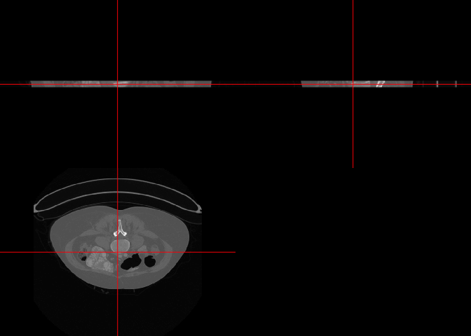

This rundown shows how to force the study time to be the same in DICOM files that are definitely from the same series.  This may happen due to issues on the scanner side.  Also, we show how to put a slice thickness value into the DICOM header and resave the images.


# Data

## Data Source

The data example is from TCIA located at https://wiki.cancerimagingarchive.net/display/Public/Pancreas-CT

Holger R. Roth, Amal Farag, Evrim B. Turkbey, Le Lu, Jiamin Liu, and Ronald M. Summers. (2016). Data From Pancreas-CT. The Cancer Imaging Archive. http://doi.org/10.7937/K9/TCIA.2016.tNB1kqBU

Clark K, Vendt B, Smith K, Freymann J, Kirby J, Koppel P, Moore S, Phillips S, Maffitt D, Pringle M, Tarbox L, Prior F. The Cancer Imaging Archive (TCIA): Maintaining and Operating a Public Information Repository, Journal of Digital Imaging, Volume 26, Number 6, December, 2013, pp 1045-1057. [paper](http://link.springer.com/article/10.1007%2Fs10278-013-9622-7)

## Getting the Data

You can download the data from TCIA. If you do not have an API key, below is a simple zip file with a small subset of the data. The
data is from https://wiki.cancerimagingarchive.net/display/Public/Pancreas-CT


```r
library(TCIApathfinder)

if (nzchar("TCIA_API_KEY")) {
  series_id = "1.2.826.0.1.3680043.2.1125.1.68878959984837726447916707551399667"
  ex = save_extracted_image_series(series_id)
  ex$response = NULL
  length(ex$dirs)
  lapply(ex, head)
}
```


The data is located at https://johnmuschelli.com/fixing_dicom_files/study_time_variation/test.zip


```r
destfile = "test.zip"
if (!file.exists(destfile)) {
  tarfile = "https://johnmuschelli.com/fixing_dicom_files/study_time_variation/test.zip"
  destfile = tempfile(fileext = ".zip")
  dl = download.file(tarfile, destfile = destfile)
}
outdir = tempdir()
result = unzip(destfile, exdir = outdir)
dirs = unique(dirname(result))
ex = list(dirs = dirs,
          files = result,
          out_file = destfile)
```

The output `ex` has the relevant information.


```r
lapply(ex, head)
```

```
$dirs
[1] "/var/folders/1s/wrtqcpxn685_zk570bnx9_rr0000gr/T//Rtmp5pmZcL/test"

$files
[1] "/var/folders/1s/wrtqcpxn685_zk570bnx9_rr0000gr/T//Rtmp5pmZcL/test/73-138.dcm" 
[2] "/var/folders/1s/wrtqcpxn685_zk570bnx9_rr0000gr/T//Rtmp5pmZcL/test/81-146.dcm" 
[3] "/var/folders/1s/wrtqcpxn685_zk570bnx9_rr0000gr/T//Rtmp5pmZcL/test/4-069.dcm"  
[4] "/var/folders/1s/wrtqcpxn685_zk570bnx9_rr0000gr/T//Rtmp5pmZcL/test/183-248.dcm"
[5] "/var/folders/1s/wrtqcpxn685_zk570bnx9_rr0000gr/T//Rtmp5pmZcL/test/164-229.dcm"
[6] "/var/folders/1s/wrtqcpxn685_zk570bnx9_rr0000gr/T//Rtmp5pmZcL/test/208-273.dcm"

$out_file
[1] "test.zip"
```

## Helper Functions

In order to parse some information on the DICOM header, we need some helper functions:


```r
library(readr)
parse_number_no_na = function(x) {
  x[ x %in% c("-", "-", "N/A")] = NA
  na_x = is.na(x)
  x = readr::parse_number(x, na = "")
  bad = is.na(x) & !na_x
  stopifnot(!any(bad))
  x
}

sub_bracket = function(x) {
  x = sub("^\\[", "", x)
  x = sub("\\]$", "", x)
  x = trimws(x)
}
```

# Getting Header information

## Header Problems 

Here we see Slice Thickness has been removed as it is no longer in the header.  The 
`read_dicom_header` reads in the DICOM files and returns the header (not pixel data) where each row is a file-tag combination and the `wide_hdr` reshapes the data so that each column is a different tag:


```r
library(dcmtk)
all_hdrs = dcmtk::read_dicom_header(path = ex$dirs[1],
                                    recursive = TRUE)
```

```
/usr/local/bin/dcmdump -q --print-all --load-short --print-filename --recurse --scan-directories '/private/var/folders/1s/wrtqcpxn685_zk570bnx9_rr0000gr/T/Rtmp5pmZcL/test' --scan-pattern  *.dcm 
```

```r
head(all_hdrs)
```

```
                                                                                  file
7  /private/var/folders/1s/wrtqcpxn685_zk570bnx9_rr0000gr/T/Rtmp5pmZcL/test/73-138.dcm
8  /private/var/folders/1s/wrtqcpxn685_zk570bnx9_rr0000gr/T/Rtmp5pmZcL/test/73-138.dcm
9  /private/var/folders/1s/wrtqcpxn685_zk570bnx9_rr0000gr/T/Rtmp5pmZcL/test/73-138.dcm
10 /private/var/folders/1s/wrtqcpxn685_zk570bnx9_rr0000gr/T/Rtmp5pmZcL/test/73-138.dcm
11 /private/var/folders/1s/wrtqcpxn685_zk570bnx9_rr0000gr/T/Rtmp5pmZcL/test/73-138.dcm
12 /private/var/folders/1s/wrtqcpxn685_zk570bnx9_rr0000gr/T/Rtmp5pmZcL/test/73-138.dcm
           tag val_rep
7  (0002,0000)      UL
8  (0002,0001)      OB
9  (0002,0002)      UI
10 (0002,0003)      UI
11 (0002,0010)      UI
12 (0002,0012)      UI
                                                                value
7                                                                 194
8                                                              00\\01
9                                                     =CTImageStorage
10 [1.2.826.0.1.3680043.2.1125.1.50515298423567268638700992255423021]
11                                              =LittleEndianImplicit
12                                                [1.2.40.0.13.1.1.1]
   length val_mult                           name
7       4        1 FileMetaInformationGroupLength
8       2        1     FileMetaInformationVersion
9      26        1        MediaStorageSOPClassUID
10     64        1     MediaStorageSOPInstanceUID
11     18        1              TransferSyntaxUID
12     18        1         ImplementationClassUID
```

```r
wide = dcmtk::wide_hdr(all_hdrs)
colnames(wide)
```

```
 [1] "file"                           "BitsAllocated"                 
 [3] "BitsStored"                     "BodyPartExamined"              
 [5] "Columns"                        "ConversionType"                
 [7] "FileMetaInformationGroupLength" "FileMetaInformationVersion"    
 [9] "FrameOfReferenceUID"            "HighBit"                       
[11] "ImageOrientationPatient"        "ImagePositionPatient"          
[13] "ImageType"                      "ImplementationClassUID"        
[15] "ImplementationVersionName"      "InstanceNumber"                
[17] "InstitutionName"                "MediaStorageSOPClassUID"       
[19] "MediaStorageSOPInstanceUID"     "Modality"                      
[21] "PatientID"                      "PatientName"                   
[23] "PhotometricInterpretation"      "PixelRepresentation"           
[25] "PixelSpacing"                   "PrivateCreator"                
[27] "RescaleIntercept"               "RescaleSlope"                  
[29] "Rows"                           "SamplesPerPixel"               
[31] "SeriesDescription"              "SeriesInstanceUID"             
[33] "SOPClassUID"                    "SOPInstanceUID"                
[35] "SpecificCharacterSet"           "StudyDate"                     
[37] "StudyDescription"               "StudyID"                       
[39] "StudyInstanceUID"               "StudyTime"                     
[41] "TransferSyntaxUID"              "UnknownTagAndData"             
```

```r
wide$SliceThickness
```

```
Warning: Unknown or uninitialised column: 'SliceThickness'.
```

```
NULL
```

We get some warnings about slice thickness as well as the study time being different:
  

```r
library(dcm2niir)
result = dcm2nii(basedir = ex$dirs[1])
```

```
#Copying Files
```

```
# Converting to nii 
```

```
'/Library/Frameworks/R.framework/Versions/3.6/Resources/library/dcm2niir/dcm2niix' -9  -v 1 -z y -f %p_%t_%s '/var/folders/1s/wrtqcpxn685_zk570bnx9_rr0000gr/T/Rtmp5pmZcL/file163ca6ae2efb2'
```

```r
length(result$nii_after)
```

```
[1] 5
```

## Trying to Merge Files

Merging/stacking the data with `-m y` `dcm2niix` output does not fix this.


```r
result = dcm2nii(basedir = ex$dirs[1], merge_files = TRUE, verbose = FALSE)
length(result$nii_after)
```

```
[1] 5
```

# Fixing Slice Thickness

Here we will estimate the slice thickness and then modify the DICOM headers to fix it.  We sort the data, copy to a temporary directory, and change the files (so we have a backup).


```r
library(dplyr)
library(tidyr)
run_df = wide %>%
  mutate(ipp = gsub("\\\\", ",", ImagePositionPatient)) %>%
  tidyr::separate(ipp, into = c("x", "y", "z"), remove = FALSE, sep = ",") %>%
  mutate_at(vars(x, y, z), parse_number_no_na) %>%
  arrange(x, y, z)

st = diff(run_df$z)
stopifnot(all(st >= 0))

ust = unique(st)
stopifnot(length(ust) == 1)
```

## Adding Slice thickness to DICOM

### Copying data

Here we copy the data to a temporary directory.


```r
tdir = tempfile()
dir.create(tdir)
file.copy(run_df$file, tdir)
```

```
 [1] TRUE TRUE TRUE TRUE TRUE TRUE TRUE TRUE TRUE TRUE TRUE TRUE
```

Using `dcmodify` to change the tag values.  The function `add_slice_thickness` takes in a file and the thickness, changes the value based on the `SliceThickness` tag `(0018,0050)` and then reads the data back in to ensure things went well:


```r
tmp_paths = file.path(tdir, basename(run_df$file))
add_slice_thickness = function(file, thickness) {
  dcmtk::dcmodify(
    file = file,
    frontopts = paste0('-i "(0018,0050)=', thickness, '"'),
    verbose = FALSE
  )
  hdr = read_dicom_header(file, verbose = FALSE)
  new_inst = as.numeric(sub_bracket(hdr$value[hdr$name == "SliceThickness"]))
  stopifnot(new_inst == thickness)
  # print(new_inst)
  bakfile = paste0(file, ".bak")
  if (file.exists(bakfile)) {
    file.remove(bakfile)
  }
  return(file)
}
thicknesses = rep(ust, length(tmp_paths))
mod_result = mapply(add_slice_thickness, tmp_paths, thicknesses)
```

Trying to stack the data, we still get a similar result as above and things are not correct.


```r
amended_result = dcm2nii(basedir = tdir, merge_files = TRUE, verbose = FALSE)
length(amended_result$nii_after)
```

```
[1] 5
```

```r
amended_result$cmd
```

```
[1] "'/Library/Frameworks/R.framework/Versions/3.6/Resources/library/dcm2niir/dcm2niix' -9  -m y  -v 0 -z y -f %p_%t_%s '/var/folders/1s/wrtqcpxn685_zk570bnx9_rr0000gr/T/Rtmp5pmZcL/file163ca660d001'"
```

# Fixing Study Time

We see that the slice thickness was not the true issue, but study time, which needs to be the same within a series.  Hence we will use the same strategy as above but will change the `StudyTime` tag:


```r
tdir = tempfile()
dir.create(tdir)
file.copy(run_df$file, tdir)
```

```
 [1] TRUE TRUE TRUE TRUE TRUE TRUE TRUE TRUE TRUE TRUE TRUE TRUE
```

Investigating the data, the date is consistent, but the time is slightly varying:
  

```r
unique(run_df$StudyDate)
```

```
[1] "[20151124]"
```

```r
unique(run_df$StudyTime)
```

```
 [1] "[165447.993059]" "[165447.991414]" "[165447.989799]"
 [4] "[165447.988178]" "[165447.986544]" "[165447.984934]"
 [7] "[165447.983305]" "[165447.981690]" "[165447.980082]"
[10] "[165447.978442]" "[165447.976820]" "[165447.975184]"
```

Here we change all DICOM `StudyTime`s to the first time using the `StudyTime` tag `(0008,0030)`:


```r
st = run_df$StudyTime[1]
st = sub_bracket(st)
ust = st

tmp_paths = file.path(tdir, basename(run_df$file))
add_study_time = function(file, thickness) {
  dcmtk::dcmodify(
    file = file,
    frontopts = paste0('-i "(0008,0030)=', thickness, '"'),
    verbose = FALSE
  )
  hdr = read_dicom_header(file, verbose = FALSE)
  new_inst = as.numeric(sub_bracket(hdr$value[hdr$name == "StudyTime"]))
  stopifnot(new_inst == thickness)
  # print(new_inst)
  bakfile = paste0(file, ".bak")
  if (file.exists(bakfile)) {
    file.remove(bakfile)
  }
  return(file)
}
thicknesses = rep(ust, length(tmp_paths))
mod_result = mapply(add_study_time, tmp_paths, thicknesses)
```

We see now that the output result is stacked correctly and has all the files:


```r
library(RNifti)
library(neurobase)
amended_result = dcm2nii(basedir = tdir, merge_files = TRUE, verbose = FALSE)
length(amended_result$nii_after)
```

```
[1] 1
```

```r
amended_result$cmd
```

```
[1] "'/Library/Frameworks/R.framework/Versions/3.6/Resources/library/dcm2niir/dcm2niix' -9  -m y  -v 0 -z y -f %p_%t_%s '/var/folders/1s/wrtqcpxn685_zk570bnx9_rr0000gr/T/Rtmp5pmZcL/file163ca6a2edfb8'"
```

```r
img = RNifti::readNifti(amended_result$nii_after[1])
img
```

```
Image array of mode "integer" (12 Mb)
- 512 x 512 x 12 voxels
- 0.8594 x 0.8594 x 1 mm per voxel
```

```r
ortho2(img)
```

<!-- -->

# Package Information

Here is my session information to ensure reproducibility for packges:

```
─ Session info ──────────────────────────────────────────────────────────
 setting  value                       
 version  R version 3.6.0 (2019-04-26)
 os       macOS Mojave 10.14.6        
 system   x86_64, darwin15.6.0        
 ui       X11                         
 language (EN)                        
 collate  en_US.UTF-8                 
 ctype    en_US.UTF-8                 
 tz       America/New_York            
 date     2019-11-13                  

─ Packages ──────────────────────────────────────────────────────────────
 package        * version     date       lib
 abind            1.4-5       2016-07-21 [1]
 assertthat       0.2.1       2019-03-21 [1]
 backports        1.1.4       2019-04-10 [1]
 bitops           1.0-6       2013-08-17 [1]
 cli              1.1.0       2019-03-19 [1]
 colorout       * 1.2-1       2019-06-19 [1]
 crayon           1.3.4       2017-09-16 [1]
 dcm2niir       * 0.6.9       2019-10-22 [1]
 dcmtk          * 0.6.8.1     2019-09-27 [1]
 digest           0.6.22      2019-10-21 [1]
 dplyr          * 0.8.3       2019-07-04 [1]
 ellipsis         0.3.0       2019-09-20 [1]
 evaluate         0.14        2019-05-28 [1]
 fs               1.3.1       2019-05-06 [1]
 git2r            0.26.1      2019-06-29 [1]
 glue             1.3.1       2019-03-12 [1]
 hms              0.5.1       2019-08-23 [1]
 htmltools        0.4.0       2019-10-04 [1]
 httr             1.4.1       2019-08-05 [1]
 knitr            1.24.3      2019-08-28 [1]
 lifecycle        0.1.0       2019-08-01 [1]
 lubridate        1.7.4       2018-04-11 [1]
 magrittr         1.5         2014-11-22 [1]
 matrixStats      0.55.0      2019-09-07 [1]
 neurobase      * 1.28.0      2019-10-14 [1]
 oro.nifti      * 0.10.1      2019-08-12 [1]
 pillar           1.4.2       2019-06-29 [1]
 pkgconfig        2.0.3       2019-09-22 [1]
 purrr            0.3.2       2019-03-15 [1]
 R.methodsS3      1.7.1       2016-02-16 [1]
 R.oo             1.22.0      2018-04-22 [1]
 R.utils          2.9.0       2019-06-13 [1]
 R6               2.4.0       2019-02-14 [1]
 Rcpp             1.0.2       2019-07-25 [1]
 readr          * 1.3.1       2018-12-21 [1]
 rlang            0.4.1       2019-10-24 [1]
 rmarkdown        1.16        2019-10-01 [1]
 RNifti         * 0.11.1      2019-09-26 [1]
 rstudioapi       0.10.0-9001 2019-09-10 [1]
 sessioninfo      1.1.1       2018-11-05 [1]
 stringi          1.4.3       2019-03-12 [1]
 stringr          1.4.0       2019-02-10 [1]
 TCIApathfinder * 1.0.7       2019-11-07 [1]
 tibble           2.1.3       2019-06-06 [1]
 tidyr          * 1.0.0       2019-09-11 [1]
 tidyselect       0.2.5       2018-10-11 [1]
 vctrs            0.2.0       2019-07-05 [1]
 withr            2.1.2       2018-03-15 [1]
 xfun             0.10        2019-10-01 [1]
 yaml             2.2.0       2018-07-25 [1]
 zeallot          0.1.0       2018-01-28 [1]
 source                             
 CRAN (R 3.6.0)                     
 CRAN (R 3.6.0)                     
 CRAN (R 3.6.0)                     
 CRAN (R 3.6.0)                     
 CRAN (R 3.6.0)                     
 Github (jalvesaq/colorout@7ea9440) 
 CRAN (R 3.6.0)                     
 local                              
 local                              
 CRAN (R 3.6.0)                     
 CRAN (R 3.6.0)                     
 CRAN (R 3.6.0)                     
 CRAN (R 3.6.0)                     
 CRAN (R 3.6.0)                     
 CRAN (R 3.6.0)                     
 CRAN (R 3.6.0)                     
 CRAN (R 3.6.0)                     
 CRAN (R 3.6.0)                     
 CRAN (R 3.6.0)                     
 Github (muschellij2/knitr@abcea3d) 
 CRAN (R 3.6.0)                     
 CRAN (R 3.6.0)                     
 CRAN (R 3.6.0)                     
 CRAN (R 3.6.0)                     
 local                              
 local                              
 CRAN (R 3.6.0)                     
 CRAN (R 3.6.0)                     
 CRAN (R 3.6.0)                     
 CRAN (R 3.6.0)                     
 CRAN (R 3.6.0)                     
 CRAN (R 3.6.0)                     
 CRAN (R 3.6.0)                     
 CRAN (R 3.6.0)                     
 CRAN (R 3.6.0)                     
 CRAN (R 3.6.0)                     
 CRAN (R 3.6.0)                     
 local                              
 Github (rstudio/rstudioapi@a7143c5)
 CRAN (R 3.6.0)                     
 CRAN (R 3.6.0)                     
 CRAN (R 3.6.0)                     
 local                              
 CRAN (R 3.6.0)                     
 CRAN (R 3.6.0)                     
 CRAN (R 3.6.0)                     
 CRAN (R 3.6.0)                     
 CRAN (R 3.6.0)                     
 CRAN (R 3.6.0)                     
 CRAN (R 3.6.0)                     
 CRAN (R 3.6.0)                     

[1] /Library/Frameworks/R.framework/Versions/3.6/Resources/library
```

